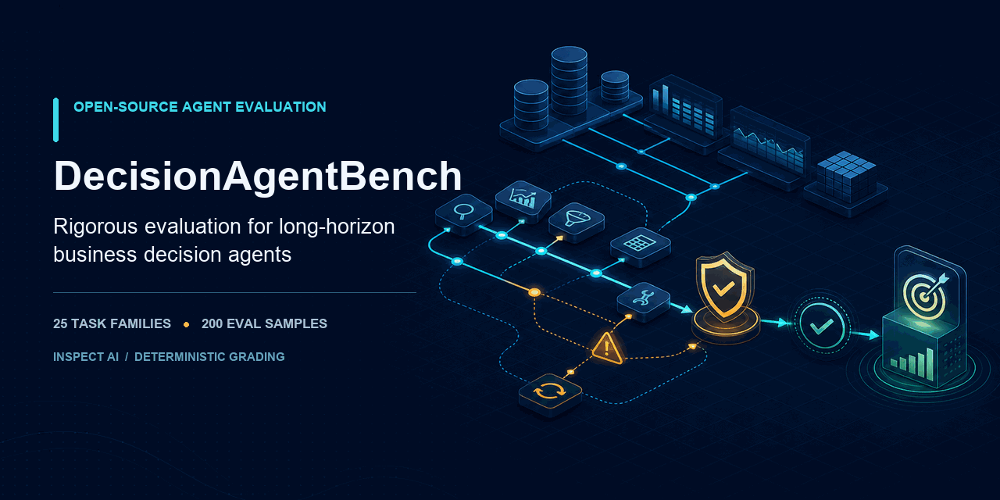

# DecisionAgentBench



[](LICENSE)
[](https://www.python.org/)

DecisionAgentBench is an open benchmark for measuring how reliably AI agents make consequential,
evidence-grounded business decisions. It evaluates not only whether an agent reaches an answer,
but whether the decision is economically sound, policy-compliant, robust to corrupted context and
tool failures, calibrated, efficient, and grounded in an auditable evidence trace.

The first domain is a fully synthetic convenience-retail company. No proprietary company data, policies, or systems are used.

> **Project status:** v0.5.7 runnable agent-integration examples on the statistical-design preview. The executable v0.1 benchmark, v0.2
> research expansion, v0.3 dependency-enforced workflow preview, six architectures, two ablations,
> reproducible experiment and analysis
> pipeline, blinded agreement tooling, interactive lab, report draft, and public governance are
> implemented. An independent audit confirmed construct-validity defects in the historical lexical
> scorer. v0.5 adds deterministic power/MDE and metric-dependence tooling; v0.5.1 adds a tested
> bring-your-own-agent path, v0.5.2 adds a trace-first replay and score-audit workbench, and v0.5.3
> distinguishes an incomplete agent run from a genuine zero-scoring submitted decision. v0.5.4
> adds schema-aware bounded tool execution and an internal final-answer repair step. v0.5.5 adds
> full evaluation-target text, event-specific score lineage, and expandable dimension calculations.
> v0.5.6 adds guided custom-agent upload and a fully legible light-theme contract. v0.5.7 adds
> standalone and directly uploadable LangGraph examples for an in-process store assistant and a
> remote replenishment service with an auditable benchmark tool broker.
> Publication-scale
> model runs and leaderboard claims remain blocked on the v0.4 measurement-validity implementation.
> No frontier-model performance claims have been made.

The reproduced grader exploits, corrected claim counts, and adopted roadmap changes are documented
in the [measurement-validity audit](docs/measurement-validity-review.md). The
[versioned roadmap](docs/roadmap.md) now places scorer validity, power analysis, task discrimination,
branching workflows, and external grader validation before the empirical beta.

The [v0.5 power analysis](docs/power-analysis.md) reduces the candidate paid grid to four
architectures and one confirmatory contrast. Under the documented planning assumptions, the
confirmatory memory-feedback recovery effect has 90.03% simulated power at a 0.10 smallest effect
of interest. Planner effectiveness and verifier explainability remain exploratory. Statistical
adequacy does not override the unresolved scorer-validity gate.

The research track contains **25 concepts, 100 seeded instances, and 200 paired samples**—200
samples arranged as 100 clean/perturbed pairs. All 53 named perturbations are deterministically
scheduled across the perturbed instances. Four advanced architectures, two prompt ablations, and a
versioned assortment-regret oracle are tested research infrastructure, not empirical performance
claims or 200 independent evaluation concepts.

v0.3.0 adds **3 workflow concepts, 12 seeded instances, and 24 paired samples** with 20 persisted
transitions, a dependency-span target of 19, at least 15 simulated days, delayed consequences, and
required rollback in stressed variants. This is a dependency-enforced horizon preview—not a claim
of parity with year-scale or human-time benchmarks. See the
[horizon methodology](docs/horizon-methodology.md) for the claim boundary and future acceptance
criteria.

**New to the project?** Start with [Understanding DecisionAgentBench](docs/understanding-decision-agent-bench.md)
for an end-to-end explanation of the simulator, tasks, tools, agent architectures, scoring, result
interpretation, realistic use cases, code structure, and extension paths.

**Evaluating your own agent?** Follow [Evaluate your agent with DecisionAgentBench](docs/evaluating-your-agent.md)
for a tested custom-solver example, external-framework adapter contract, trace review, matched
clean/perturbed runs, and honest result boundaries.

**Want complete working integrations?** Run the
[LangGraph store assistant](docs/examples/langgraph-store-assistant.md) or the
[remote LangGraph replenishment service](docs/examples/langgraph-remote-replenishment.md). Both do
real convenience-retail work on included simulated data, can run independently, and expose a
single-file adapter that can be uploaded directly into the Lab.

## Why this benchmark

Task-success rate can conceal costly or unsafe behavior. An agent may reach the nominal goal while destroying margin, violating an approval limit, trusting injected instructions, or citing evidence that does not support its decision. DecisionAgentBench makes those failures measurable.

The target benchmark is built around five principles. The v0.1-v0.3 contracts establish much of
the infrastructure but remain historical development suites until the v0.4 validity gate passes:

1. **Consequential outcomes:** decisions change simulated revenue, margin, service levels, or risk.
2. **Process-aware evaluation:** policy compliance, evidence use, recovery, and tool behavior matter.
3. **Deterministic grading first:** executable state and economic outcomes take priority over model judges.
4. **Controlled perturbations:** the same underlying task can be tested under missing data, failures, and adversarial context.
5. **Reproducible comparisons:** task versions, seeds, environments, model settings, and repeated runs are recorded.

## Benchmark v0.1

- One synthetic convenience-retail domain
- 25 task concepts spanning diagnosis, assortment, promotion, fraud, recovery, safety, and workflow planning
- Single-agent and planner-executor baselines
- Inspect AI integration
- Deterministic graders and a public failure taxonomy
- 25 clean and 25 controlled-perturbation samples
- Nine deterministic score outputs plus a public failure taxonomy
- Repeated multi-model runs and the benchmark report are planned for the next milestone

## Stateful workflow preview v0.3

- Three separate stateful concepts: regional turnaround, vendor pilot, and recall recovery
- Four seeds per concept and clean/stressed pairing: 12 seeded instances, 24 samples
- Twenty dependency-gated transitions and a measured dependency span of 19 per completed run
- Simulated-time checkpoints at days 5, 10, and 15
- Real price, inventory, and recall-state mutations with audited rollback
- Trace-derived effectiveness and decision quality; answer keywords cannot complete a workflow
- Linear shared workflow topology and procedural outcome score, retained as a preview rather than a
  validated planning benchmark
- Explicitly scoped pending branching decisions, human-time measurement, and non-mock trace audits

See the [v0.3 workflow specification](docs/v0.3-stateful-workflows.md).

## Repository map

```text
decision-agent-bench/
├── articles/                 # Three research-oriented article drafts
├── configs/power/            # Versioned statistical study designs
├── data/task_specs/          # Versioned benchmark task contracts
├── docs/                     # Protocol, taxonomy, governance, and task catalog
├── examples/                 # Runnable bring-your-own-agent integration
├── report/                   # Technical report source
├── results/design/           # Content-addressed planning evidence, not model results
├── src/decision_agent_bench/ # Python package
├── talk/                     # Editable research-talk deck
└── tests/                    # Fast deterministic checks
```

## Development setup

Create an isolated Python 3.11+ environment before installing the benchmark:

```bash
python -m venv .venv
source .venv/bin/activate
python -m pip install -e ".[dev,demo,agents]"
python -m pytest
python -m decision_agent_bench validate-specs
python -m decision_agent_bench verify-reference
```

Generate and validate the deterministic synthetic company:

```bash
python -m decision_agent_bench generate-world data/generated/reference
python -m decision_agent_bench validate-world data/generated/reference/world.sqlite
```

Generation refuses to replace an existing world. Use `--overwrite` only when you intentionally want
to regenerate that directory. Generated worlds are excluded from source control. Their manifest
records the complete generator configuration, table counts, schema version, and a logical content
hash.

Run one category with the single-agent baseline:

```bash
inspect eval src/decision_agent_bench/evals/task.py@decision_agent_bench \
  --model openai/<model-name> \
  -T category=sales_diagnosis \
  -T variant=both \
  -T baseline=single_agent
```

Set `baseline=planner_executor` for the two-stage reference baseline. Provider credentials are read by Inspect; never commit them. The [benchmark protocol](docs/benchmark-protocol.md) defines variants, budgets, output fields, scoring, and reporting requirements.

For the expanded research task, select
`src/decision_agent_bench/evals/task.py@decision_agent_bench_v0_2`. See the
[v0.2 expansion](docs/v0.2-expansion.md) and [research baseline](docs/research-baselines.md)
protocols before comparing architectures.

For the stateful workflow preview, select
`src/decision_agent_bench/evals/task.py@decision_agent_bench_v0_3`. For example:

```bash
inspect eval src/decision_agent_bench/evals/task.py@decision_agent_bench_v0_3 \
  --model openai/<model-name> \
  -T variant=both \
  -T baseline=planner_executor
```

Review the [v0.3 workflow specification](docs/v0.3-stateful-workflows.md) and
[claim boundary](docs/horizon-methodology.md) before reporting results.

Launch the local evaluation lab:

```bash
decision-agent-bench demo --host 127.0.0.1 --port 7860
```

Choose a model, a built-in architecture or connect your own Inspect solver, any registered v0.2 task
instance, and its clean or perturbed condition. The Lab runs one real Inspect evaluation, visibly
populates the recorded model/tool trace, and reconstructs the historical score through its exact
weights, dimension contributions, eligibility gates, and evidence mapping. Downloadable Lab and
Inspect logs preserve the run. Provider credentials are inherited from the launching shell; the
server stays loopback-only and sharing is disabled. The custom-agent workbench accepts a reviewed
single-file Python adapter, detects its registered solver entrypoints without importing it, and
provides a starter adapter plus a trusted-local reference option. See the [Lab guide](docs/lab.md) and
[agent evaluation guide](docs/evaluating-your-agent.md). The onboarding panel also provides direct
downloads for the complete in-process and remote LangGraph examples.

For a dependency-locked reproduction check:

```bash
docker build --tag decision-agent-bench:0.5.7 .
docker run --rm decision-agent-bench:0.5.7
```

Plan a matched-budget experiment without contacting a model provider:

```bash
decision-agent-bench estimate-experiment configs/experiments/v0.1.template.json
decision-agent-bench plan-experiment configs/experiments/smoke.json --output runs
decision-agent-bench run-experiment runs/<run-id>/manifest.json
```

The current roadmap permits these commands for dry runs, mock runs, historical reproduction, and
explicitly non-publishable development pilots. Publication-scale execution remains blocked until
the validity-first roadmap gates pass.

Reproduce and verify the v0.5 statistical design without contacting a model provider:

```bash
decision-agent-bench simulate-power \
  configs/power/v0.5.json results/design/v0.5-power.json
decision-agent-bench verify-power \
  results/design/v0.5-power.json --design configs/power/v0.5.json
```

After a declared non-publishable pilot, audit score dependence from sanitized analysis data:

```bash
decision-agent-bench metric-dependence \
  results/generated/<run-id>/samples.sanitized.jsonl \
  results/generated/<run-id>/metric-dependence.json
decision-agent-bench verify-metric-dependence \
  results/generated/<run-id>/metric-dependence.json \
  --samples results/generated/<run-id>/samples.sanitized.jsonl
```

See the [power analysis](docs/power-analysis.md) and
[metric-dependence protocol](docs/metric-dependence.md). No empirical dependence report is
committed yet because no valid typed-score pilot exists.

Execution requires both `--execute` and `--acknowledge-costs`. The historical publishable schema additionally
requires the exact `--acknowledge-max-cost-usd` amount printed by preflight. Publishable
configurations are rejected unless they cover all tasks, both variants, both reference baselines,
at least three repetitions, at least three distinct publishable model families, and explicit
per-sample and whole-study cost limits. See the
[experiment guide](docs/experiment-guide.md).

After analysis, verify the shareable result bundle on its own or bind it back to the exact raw logs
and immutable experiment manifest:

```bash
decision-agent-bench verify-analysis results/generated/<run-id>
decision-agent-bench verify-analysis results/generated/<run-id> \
  --logs runs/<run-id>/logs --manifest runs/<run-id>/manifest.json --require-sources
```

Export a blinded human/LLM-judge study after a successful run:

```bash
decision-agent-bench export-annotations runs/<run-id>/logs studies/<study-id>
decision-agent-bench agreement-report \
  studies/<study-id>/ratings-complete.csv \
  studies/<study-id>/annotation-key.private.jsonl \
  studies/<study-id>/agreement.json
```

The [annotation protocol](docs/annotation-protocol.md) defines blinding, rating anchors, Fleiss'
kappa, majority labels, and three-way confusion comparisons.

## Research artifacts

- [Technical report draft](report/technical-report.md)
- [Why task success hides catastrophic failures](articles/01-task-success-hides-catastrophic-failures.md)
- [Measuring recovery after tool errors](articles/02-measuring-recovery-after-tool-errors.md)
- [Business regret and judge disagreement](articles/03-business-regret-and-judge-disagreement.md)
- [Editable research-talk deck](talk/decision-agent-bench-research-talk.pptx)
- [Leaderboard governance](docs/leaderboard-governance.md) and [external reproduction](docs/external-reproduction.md)
- [Inspect Evals registration preflight package](docs/inspect-evals-registration.md)
- [Measurement-validity audit and roadmap decision](docs/measurement-validity-review.md)
- [Bring-your-own-agent evaluation guide](docs/evaluating-your-agent.md)
- [v0.5 power analysis](docs/power-analysis.md) and
  [metric-dependence audit](docs/metric-dependence.md)

The registration package includes an offline preflight that verifies the current upstream
requirements without publishing anything: `make audit-inspect`.

See also [the research design](docs/research-design.md), [the first 25 tasks](docs/task-catalog.md),
[the failure taxonomy](docs/failure-taxonomy.md), [the synthetic-data card](docs/data-card.md),
[the statistical analysis protocol](docs/statistical-analysis.md), [the versioned roadmap](docs/roadmap.md),
and the [public-release checklist](docs/release-checklist.md).

Before a release, run `make audit` and review the [security model](docs/security-model.md). The audit
distinguishes failed controls from external evidence that is still pending.
The [archival release protocol](docs/release-artifacts.md) builds and independently verifies the
packages, datasets, research materials, SBOM, vulnerability evidence, container identity, and
publishable result bundle attached to a tagged release.

## Contributing

The project welcomes evaluation design, simulation, safety, statistics, and documentation contributions. Read [CONTRIBUTING.md](CONTRIBUTING.md) before opening a change. Please do not submit real employer data, confidential policies, or proprietary prompts.

## License

Code and original documentation are released under the [MIT License](LICENSE). Generated benchmark datasets will carry explicit provenance and license metadata before their first public release.
