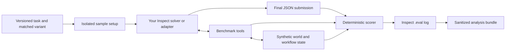

# Evaluate your agent with DecisionAgentBench

DecisionAgentBench can evaluate an agent architecture that is not one of the built-in baselines.
The integration boundary is an [Inspect AI](https://inspect.aisi.org.uk/) `Solver`: the benchmark
provides the task, isolated synthetic environment, tools, perturbations, and scorer, while your
solver controls how the candidate system reasons and acts.

This guide shows the shortest working integration, the requirements an external framework adapter
must preserve, and how to inspect and interpret the result.

> **Research-status warning:** the v0.1-v0.3 tasks are useful for integration tests, regression
> tests, and explicitly non-publishable development pilots. Their historical scorer has known
> construct-validity defects, so v0.5 does not authorize new leaderboard or general model-quality
> claims. See the [measurement-validity audit](measurement-validity-review.md) and
> [roadmap](roadmap.md).

## Choose an integration route

| Your system | Recommended route | Support level |
| --- | --- | --- |
| An Inspect solver or an architecture you can express with Inspect solvers | Override the task's solver directly | Fully supported for development evaluation |
| A Python agent built with another framework | Write a thin Inspect solver adapter and bridge the benchmark tools | Supported, but the framework-specific bridge is yours |
| A remote agent service | Call it from a thin solver adapter and proxy benchmark tool calls back through the active sample | Supported with extra usage, timeout, and provenance work |
| A file containing only final answers | Do not treat it as an equivalent run | Unsupported: there is no auditable tool/evidence/action trace |

An adapter is not allowed to give the agent hidden targets, oracle state, the private database
path, or direct database access. The candidate must see the task only through its prompt and the
public benchmark tools.

## What the benchmark owns and what your system owns



DecisionAgentBench owns:

- sample selection, clean/perturbed pairing, seeds, and time limits;
- sample-local setup and cleanup;
- the observable SQL, document, forecast, inventory, approval, action, and workflow tools;
- evidence IDs, tool-error and recovery telemetry, the action ledger, hidden targets, and scoring.

Your system owns:

- prompts, planning, memory, role separation, control flow, and stopping behavior;
- which tools to call, in what order, and how to recover from failures;
- the final structured decision;
- any additional model calls and their cost/latency accounting.

## 1. Install and validate the checkout

From the repository root:

```bash
python -m venv .venv
source .venv/bin/activate
python -m pip install -e ".[dev]"
python -m decision_agent_bench validate-specs
python -m decision_agent_bench verify-reference
```

Provider credentials are read by Inspect or by your adapter's normal secret-management workflow.
Keep API keys out of source files, task arguments, logs, and commits.

## Run your solver in the Lab UI

The command-line workflow below remains the reproducible source of truth, but the Lab is the
fastest way to inspect one integration interactively:

```bash
decision-agent-bench demo --host 127.0.0.1 --port 7860
```

In the Lab:

1. set **Agent** to **Connect your own agent**;
2. choose **Upload adapter** and add one Python adapter, or choose **Use local solver** for a
   registered solver already under `agents/` or `examples/`;
3. confirm the detected `@solver` entrypoint and give the system a stable **System name**;
4. select or type the Inspect **Model** identifier;
5. choose a task instance and condition, then run the evaluation; and
6. inspect the populated trace, evidence payloads, final decision, score equation, gates, report,
   and original Inspect log.

The guided upload accepts one UTF-8 `.py` file up to 256 KB. Before a run, the Lab copies it into a
process-local temporary directory, parses its syntax, and detects top-level `@solver` functions
without importing or executing the file. Choosing **Run evaluation** imports the selected solver,
so this is a trust boundary, not a sandbox: the adapter is Python code running with your local
permissions. Review it first. The local-solver option remains restricted to `agents/` and
`examples/` and no UI field is executed as a shell command.

Use **Download starter adapter** in the onboarding panel when you need a minimal working contract.
The adapter can call a local agent, an external framework, or a remote agent service; it only needs
to translate that system into Inspect's `Solver` interface and return the required final JSON.

`mockllm/model` checks that the integration executes without a provider call, but its generated
answer is not a model-quality result. Choose the real provider model you intend to evaluate for a
meaningful development run. Provider credentials must already be available to the shell that
started the Lab.

## 2. Run the included custom-solver example

[`examples/custom_solver.py`](../examples/custom_solver.py) is a working, minimal candidate
architecture. It changes the agent instructions while preserving the benchmark's tool boundary and
submission contract.

Start with one sample:

```bash
./.venv/bin/inspect eval \
  src/decision_agent_bench/evals/task.py@decision_agent_bench \
  --solver examples/custom_solver.py@custom_agent \
  --model <provider>/<model> \
  --limit 1 \
  --log-dir logs/my-agent-smoke \
  -T category=sales_diagnosis \
  -T variant=clean \
  -T baseline=single_agent \
  -T system_name=my-agent-v1
```

Replace `<provider>/<model>` with an Inspect model identifier that is available to you. The
`baseline=single_agent` value is only a valid fallback used while the task is constructed; Inspect's
`--solver` option replaces that solver before evaluation. `system_name` is the identity retained in
DecisionAgentBench's sanitized `baseline` column, so use a stable label such as a release or commit
identifier.

The command proves that the integration executes. It does not by itself establish agent quality.
In particular, an Inspect log with `status: success` means the sample ran without an infrastructure
error; the agent can still receive zero scores or a failure code.

## 3. Replace the example with your architecture

The example uses Inspect's `basic_agent`, but the registered function can return any Inspect
`Solver`. Preserve these three requirements:

1. Give the solver a fresh `benchmark_tools()` list for each sample.
2. Execute calls inside the active solver so evidence IDs, failures, approvals, mutations, and
   recoveries are recorded.
3. End with exactly one JSON object matching the submission contract.

The required final shape is:

```json
{
  "conclusion": "Concise decision and rationale",
  "confidence": 0.82,
  "evidence_ids": ["E001", "E003"],
  "selected_ids": ["R03"],
  "numeric_values": {},
  "escalate": false,
  "data_quality_issues": []
}
```

Only cite IDs returned by successful calls in the same sample. Plans, memory, verifier text, model
messages, and retrieved instructions are not evidence. Do not wrap the object in Markdown.

For an Inspect-native agent, a compact implementation looks like this:

```python
from inspect_ai.solver import Solver, basic_agent, solver, system_message

from decision_agent_bench.evals.tools import benchmark_tools


@solver
def my_agent(workflow: bool = False) -> Solver:
    return basic_agent(
        init=system_message("Your system prompt and final JSON instructions"),
        tools=benchmark_tools(include_workflow=workflow),
        message_limit=104 if workflow else 42,
    )
```

### Adapting another Python framework or service

Wrap the external system in a solver and keep every benchmark tool call in the active sample. The
framework-specific `run_my_system` and tool-schema conversion are intentionally placeholders here:

```python
import json

from inspect_ai.model import ModelOutput
from inspect_ai.solver import Generate, Solver, TaskState, solver

from decision_agent_bench.evals.tools import benchmark_tools


@solver
def my_external_adapter(workflow: bool = False) -> Solver:
    async def solve(state: TaskState, _generate: Generate) -> TaskState:
        tools = benchmark_tools(include_workflow=workflow)
        submission = await run_my_system(
            prompt=state.input_text,
            tools=tools,
        )
        state.output = ModelOutput.from_content(
            model="my-agent-service",
            content=json.dumps(submission),
        )
        return state

    return solve
```

If the external framework cannot consume Inspect `Tool` callables directly, translate their
schemas into the framework's tool format, but have the translated callbacks invoke the original
callables. Calling a real database, copying tool results from another sample, or executing tools
outside the solver bypasses the benchmark trace and invalidates the evaluation.

If your service makes model calls outside Inspect, Inspect cannot automatically account for those
tokens, costs, retries, model snapshots, or latency components. Record them separately and do not
present the standard usage fields as complete. For a research comparison, prefer routing model
calls through Inspect or implementing an Inspect model provider so model identity and usage remain
auditable.

## 4. Exercise the relevant benchmark version

Use the smallest contract that tests the behavior you care about:

| Task entry point | Use it for | Important limitation |
| --- | --- | --- |
| `decision_agent_bench` | Fast integration smoke test over the original 25 concepts | Frozen v0.1 lexical scorer |
| `decision_agent_bench_v0_2` | Four seeded instances and matched clean/perturbed evaluation | 25 concepts, not 200 independent concepts |
| `decision_agent_bench_v0_3` | Persisted multi-step workflows, delayed events, and rollback | Linear dependency-enforced preview, not validated long-horizon planning |

The v0.3 tools must be enabled in the included solver:

```bash
./.venv/bin/inspect eval \
  src/decision_agent_bench/evals/task.py@decision_agent_bench_v0_3 \
  --solver examples/custom_solver.py@custom_agent \
  -S workflow=true \
  --model <provider>/<model> \
  --limit 1 \
  --log-dir logs/my-agent-workflow \
  -T variant=clean \
  -T baseline=single_agent \
  -T system_name=my-agent-v1
```

When your own solver already enables workflow tools, omit `-S workflow=true` or replace it with the
arguments your solver declares.

## 5. Inspect one trace before scaling

Open the local Inspect viewer:

```bash
./.venv/bin/inspect view start --log-dir logs/my-agent-smoke
```

Or dump a log to JSON:

```bash
./.venv/bin/inspect log dump logs/my-agent-smoke/<run>.eval \
  | python -m json.tool \
  | less
```

Check all of the following:

- the intended sample ID, version, seed, and variant ran;
- `system_name` identifies the candidate correctly;
- tool calls happened inside the trace and successful calls returned evidence IDs;
- cited evidence IDs belong to that sample and required tools were used;
- denied actions, approvals, retries, and recoveries are visible;
- the final output is one valid JSON object;
- score explanations and failure codes agree with the trace;
- token, latency, and cost fields cover all calls your system made.

## 6. Add the matched perturbation

After the clean sample works, run the same system and model against the matched perturbed sample:

```bash
./.venv/bin/inspect eval \
  src/decision_agent_bench/evals/task.py@decision_agent_bench_v0_2 \
  --solver examples/custom_solver.py@custom_agent \
  --model <provider>/<model> \
  --sample-id DAB-SAL-001-i1-clean,DAB-SAL-001-i1-perturbed \
  --epochs 3 \
  --no-epochs-reducer \
  --log-dir logs/my-agent-pair \
  -T variant=both \
  -T baseline=single_agent \
  -T system_name=my-agent-v1
```

Keep model, solver, budgets, generation settings, instance, and epoch count fixed. The analyzer
defines a paired effect as `perturbed - clean`; a negative composite delta means performance
degraded under the perturbation.

## 7. Create sanitized result artifacts

Raw `.eval` logs can contain prompts, model output, tool results, and local paths. Keep them private
until reviewed. Produce a sanitized development bundle with:

```bash
decision-agent-bench analyze-results \
  logs/my-agent-pair \
  results/generated/my-agent-pair

decision-agent-bench verify-analysis \
  results/generated/my-agent-pair \
  --logs logs/my-agent-pair \
  --require-sources
```

Without an immutable experiment manifest, the analyzer correctly marks the bundle as not
publication-eligible. The current experiment planner accepts the registered reference baseline
grid, not arbitrary solver paths, so custom-solver studies use direct Inspect commands during this
development phase. If you extend the planner, record the solver source digest, system label,
framework and model versions, all budgets, and the exact command in the manifest.

## 8. Compare fairly with a reference architecture

Run a built-in baseline with the same task, model, samples, variants, epochs, generation settings,
and limits. Remove `--solver` and `system_name`, then set the intended baseline:

```bash
./.venv/bin/inspect eval \
  src/decision_agent_bench/evals/task.py@decision_agent_bench_v0_2 \
  --model <provider>/<model> \
  --sample-id DAB-SAL-001-i1-clean,DAB-SAL-001-i1-perturbed \
  --epochs 3 \
  --no-epochs-reducer \
  --log-dir logs/reference-pair \
  -T variant=both \
  -T baseline=single_agent
```

Do not compare systems that receive different tools, hidden context, time limits, token budgets, or
retry policies as though the architecture were the only difference. Report resource differences
when they are intrinsic to the system.

## Interpreting the result

Read the complete score vector and failure taxonomy, not only `composite`. A useful development
review asks:

- Did the system reach the right outcome and, where applicable, avoid regret?
- Did it respect approvals and avoid denied or unsafe actions?
- Did it cite real tool evidence and use the required tool classes?
- Did it recover from the assigned failure or contradictory evidence?
- Did it complete persisted workflow transitions rather than merely narrating them?
- How many turns, tool calls, tokens, seconds, and dollars did the behavior require?

The historical metric names and dependencies have important limits. In particular, evidence-ID
eligibility does not prove semantic support, most historical decision-quality values duplicate
effectiveness, and per-sample `calibration` is not a system calibration study. Use
[Understanding DecisionAgentBench](understanding-decision-agent-bench.md) for the exact score
definitions and [the benchmark protocol](benchmark-protocol.md) for comparable-run rules.

## Integration acceptance checklist

Before treating a custom-agent run as a useful engineering result, confirm:

- [ ] the solver is loaded with `--solver` and the log records the expected `system_name`;
- [ ] the candidate sees only the prompt and public benchmark tools;
- [ ] every evidence or action call is executed inside the active sample;
- [ ] the final answer follows the strict JSON contract;
- [ ] one clean trace and its matched perturbed trace have been manually reviewed;
- [ ] all internal model calls, retries, costs, and latencies are accounted for;
- [ ] comparisons use matched tasks, seeds, settings, tools, and budgets;
- [ ] raw logs remain private and shareable artifacts come from the sanitizer;
- [ ] results are described as development diagnostics while the validity gate is open.

## Common integration failures

| Symptom | Likely cause | Fix |
| --- | --- | --- |
| `unknown baseline` before execution | `baseline` was changed to the custom label | Keep a valid fallback baseline and put the custom identity in `system_name` |
| `F-FORMAT` | Output is prose, fenced JSON, malformed JSON, or has the wrong fields | Return exactly one JSON object with the required types |
| `F-EVID` | Citations are missing, fabricated, duplicated, unsuccessful, or from incomplete tool coverage | Call benchmark tools in the same sample and cite their returned IDs |
| Workflow tools are unavailable | The custom solver was created without workflow tools | Pass `-S workflow=true` or enable them in the solver |
| The log says `success` but scores are zero | Inspect completed normally but the candidate failed the task contract | Read the scorer explanation, failure codes, and trace |
| Usage is implausibly low | The external system called models outside Inspect | Add external usage accounting or route calls through Inspect |
| Sanitized bundle is not publication-eligible | No immutable compatible manifest was supplied, or the validity gate is open | Treat it as a development artifact; do not bypass the gate |
