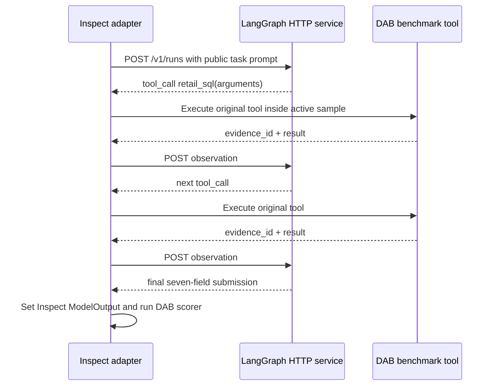

# Example 2: a remote LangGraph replenishment service

[`examples/langgraph_replenishment_service.py`](../../examples/langgraph_replenishment_service.py)
is a complete HTTP agent service plus a DecisionAgentBench client adapter. It demonstrates the
"remote agent service" route from the main [agent-evaluation guide](../evaluating-your-agent.md).

## What the agent does

The service is a replenishment desk for a convenience-store manager. In standalone mode it:

1. estimates target inventory from average daily units and delivery lead time;
2. converts unit needs into vendor-constrained case quantities;
3. limits fresh-food cover to reduce spoilage;
4. allocates a store-wide case budget by stockout and margin priority; and
5. returns a ready-to-review order brief.

The supplied snapshot identifies P021 as the immediate delivery-gap risk and produces a bounded
eight-case plan across three products.

For DecisionAgentBench, the same service acts as a vendor-constrained replacement agent. It asks
the adapter for observable candidate economics, vendor constraints, and S001 shelf economics, then
selects the feasible product with the strongest observed 28-day margin opportunity.

## Architecture and tool-broker protocol

The service uses LangGraph `StateGraph` workflows and LangChain `RunnableLambda` nodes. The remote
service never receives a database path or calls the synthetic world directly.



This broker is the critical adaptation. A naive remote service that receives a database credential
or returns fabricated evidence IDs would bypass the benchmark and invalidate the result.

## Install

From the repository root:

```bash
python -m venv .venv
source .venv/bin/activate
python -m pip install -e ".[agents,demo]"
```

## Run it by itself

Run the business graph directly against the included simulated snapshot:

```bash
python examples/langgraph_replenishment_service.py demo
```

Or supply another snapshot:

```bash
python examples/langgraph_replenishment_service.py demo \
  --snapshot path/to/replenishment_snapshot.json
```

The sample input is
[`examples/data/replenishment_snapshot.json`](../../examples/data/replenishment_snapshot.json).
Each product supplies on-hand units, average daily units, case pack, lead time, minimum order,
vendor capacity, and unit margin. Store constraints supply target cover, fresh-food cover, and the
maximum total cases.

## Run it as an HTTP service

Start the service in one terminal:

```bash
source .venv/bin/activate
python examples/langgraph_replenishment_service.py serve --host 127.0.0.1 --port 8099
```

Check it from another terminal:

```bash
curl http://127.0.0.1:8099/health
```

Call the standalone manager-brief endpoint:

```bash
python -c \
  'import json; print(json.dumps({"snapshot": json.load(open("examples/data/replenishment_snapshot.json"))}))' \
  | curl -X POST http://127.0.0.1:8099/v1/store-brief \
      -H 'content-type: application/json' --data-binary @-
```

The interactive API schema is available at `http://127.0.0.1:8099/docs` while the service is
running. Keep the example bound to `127.0.0.1`; add authentication, TLS, request limits, durable
state, and a restrictive network policy before adapting this pattern to a non-local deployment.

## Evaluate it in the Lab

Keep the service running on port 8099, then start the Lab in a second terminal:

```bash
decision-agent-bench demo --host 127.0.0.1 --port 7860
```

In the Lab:

1. set **Agent** to **Connect your own agent**;
2. choose **Upload adapter**;
3. upload `examples/langgraph_replenishment_service.py`;
4. confirm `langgraph_remote_replenishment` as the entrypoint;
5. use `langgraph-replenishment-service-v1` as the system name;
6. choose `mockllm/model` because this service is deterministic and makes no external model calls;
7. select `DAB-ASS-001-i1`, choose the clean condition, and run; and
8. inspect the brokered SQL calls, three evidence IDs, selected replacement, oracle regret, gates,
   and score explanation.

The adapter defaults to `http://127.0.0.1:8099`, so the uploaded single file works without an
additional Lab field. A different service URL can be supplied from Inspect's CLI:

```bash
./.venv/bin/inspect eval \
  src/decision_agent_bench/evals/task.py@decision_agent_bench_v0_6 \
  --solver examples/langgraph_replenishment_service.py@langgraph_remote_replenishment \
  -S service_url=http://127.0.0.1:8099 \
  --model mockllm/model \
  --sample-id DAB-ASS-001-i1-clean \
  --log-dir logs/langgraph-remote-replenishment \
  -T category=assortment \
  -T variant=clean \
  -T baseline=single_agent \
  -T system_name=langgraph-replenishment-service-v1
```

Loopback origins are accepted by default. For a non-loopback deployment, use HTTPS and explicitly
allow-list its hostname in the shell that launches Inspect or the Lab:

```bash
export DAB_REMOTE_AGENT_ALLOWLIST=agents.example.com
```

## How it was adapted to DecisionAgentBench

The file deliberately separates the service and adapter responsibilities:

### Service responsibilities

- own the LangGraph state machine, tool-request sequence, failure retry, and final decision;
- see only the public task prompt and observations explicitly returned by the adapter;
- return typed `tool_call` or `complete` messages; and
- emit a strict seven-field DecisionAgentBench submission at completion.

### Adapter responsibilities

- create fresh benchmark tools inside the active Inspect sample;
- translate the service's tool request into a call to the original Inspect callable;
- post the exact returned evidence ID and result—or a sanitized error—back to the service;
- enforce a ten-step broker budget and HTTP timeout;
- delete process-local service run state after completion; and
- place the service's final JSON in `TaskState.output` for deterministic scoring.

No provider model is used in this example, so the adapter records that external model usage is zero.
If your remote service calls a model, record its model snapshot, tokens, retries, cost, and latency
separately; Inspect cannot infer usage that happens behind your HTTP boundary.

## What to change for your own service

1. Keep the broker protocol or an equivalent callback mechanism so benchmark tools remain inside
   the active sample.
2. Replace the deterministic service graph with your production graph, memory, or model calls.
3. Authenticate both sides and keep `DAB_REMOTE_AGENT_ALLOWLIST` restricted to reviewed service
   origins; never accept arbitrary user-supplied callback URLs.
4. Propagate correlation IDs and retain only sanitized operational telemetry.
5. Make retries idempotent and use a durable checkpointer when service restarts must resume runs.
6. Report all resource usage that occurs outside Inspect.

## Honest limitations

- The in-memory run store is demonstration infrastructure, not a production persistence layer.
- The default service has no authentication and must remain local.
- The agent is optimized for the DAB-ASS-001 replacement workflow, not every benchmark category.
- The score is a development diagnostic while the benchmark's measurement-validity gate remains
  open.
