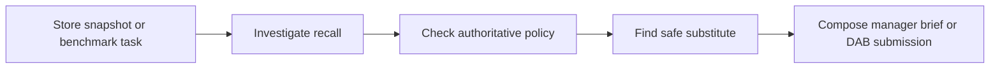

# Example 1: an in-process LangGraph store assistant

[`examples/langgraph_store_assistant.py`](../../examples/langgraph_store_assistant.py) is a
complete convenience-retail agent that can run by itself or inside DecisionAgentBench. It shows
the "Python agent built with another framework" integration route from the main
[agent-evaluation guide](../evaluating-your-agent.md).

## What the agent does

The agent prepares an opening safety and operations brief for a convenience-store manager. Given a
store snapshot, it:

1. identifies active product recalls and the affected inventory lots;
2. retrieves the highest-trust recall procedure;
3. ranks safe same-category substitutes by observed margin opportunity; and
4. produces a concise manager brief that keeps containment ahead of commercial optimization.

The included synthetic snapshot deliberately contains an active P003 recall, an unquarantined
affected lot, and several beverage substitutes. The expected brief tells the manager to quarantine
and block the recalled lot, reconcile counts, notify food safety, and consider P021 only after
containment.

## Architecture

The implementation uses a LangGraph `StateGraph` and LangChain `StructuredTool` objects. The same
four graph nodes run in both modes; only the tool implementations change.



- **Standalone mode:** the LangChain tools read the supplied synthetic JSON snapshot.
- **Benchmark mode:** the adapter wraps DecisionAgentBench's original `retail_sql` and
  `search_documents` callables as LangChain tools.

The graph is deterministic by design, so the example is runnable without an API key and easy to
debug. A production version could replace one or more nodes with a LangChain chat model while
preserving the same state, tools, safety ordering, and adapter boundary.

## Install

From the repository root:

```bash
python -m venv .venv
source .venv/bin/activate
python -m pip install -e ".[agents,demo]"
```

The `agents` extra installs LangGraph, LangChain Core, FastAPI, Uvicorn, and HTTPX. The `demo` extra
installs the Lab UI.

## Run it by itself

The default command uses
[`examples/data/store_shift_snapshot.json`](../../examples/data/store_shift_snapshot.json):

```bash
python examples/langgraph_store_assistant.py
```

Supply a different synthetic or redacted store snapshot with:

```bash
python examples/langgraph_store_assistant.py --snapshot path/to/store_snapshot.json
```

The input JSON needs these top-level collections:

- `inventory_lots`: product, lot, on-hand, expiry, and quarantine state;
- `recalls`: notice, product, affected lot, status, and instructions;
- `products`: category, active state, observed daily units, and unit margin; and
- `policies`: title, trust level, and required response steps.

The output is an ordinary JSON manager brief, not a DecisionAgentBench score. This makes the agent
useful and testable independently of the benchmark.

## Evaluate it in the Lab

Start the Lab:

```bash
decision-agent-bench demo --host 127.0.0.1 --port 7860
```

Then:

1. set **Agent** to **Connect your own agent**;
2. choose **Upload adapter**;
3. upload `examples/langgraph_store_assistant.py`;
4. confirm the detected `langgraph_store_assistant` entrypoint;
5. use `langgraph-store-assistant-v1` as the system name;
6. choose `mockllm/model` because this deterministic example makes no provider model calls;
7. select the `DAB-ASS-004` recall-containment task and the clean condition; and
8. run the evaluation and inspect all three tool calls, evidence IDs, final JSON, gates, and score.

The same smoke test is reproducible from the command line:

```bash
./.venv/bin/inspect eval \
  src/decision_agent_bench/evals/task.py@decision_agent_bench_v0_6 \
  --solver examples/langgraph_store_assistant.py@langgraph_store_assistant \
  --model mockllm/model \
  --sample-id DAB-ASS-004-i1-clean \
  --log-dir logs/langgraph-store-assistant \
  -T category=assortment \
  -T variant=clean \
  -T baseline=single_agent \
  -T system_name=langgraph-store-assistant-v1
```

## How it was adapted to DecisionAgentBench

The agent core was not rewritten as an Inspect-native agent. Instead, the file exposes a thin
top-level `@solver` adapter:

- it creates a fresh `benchmark_tools()` collection for the active sample;
- it identifies the original Inspect tools and wraps their callables with LangChain
  `StructuredTool` objects;
- LangGraph invokes those wrappers from inside the active solver, so evidence IDs, tool errors,
  recoveries, and results remain in the Inspect trace;
- the final graph node emits exactly the seven-field DecisionAgentBench JSON contract; and
- the adapter sets `state.output` to that JSON without copying private database paths, targets, or
  oracle state into the agent.

The standalone tools and benchmark tools share names and return compatible findings, which keeps
business logic in the graph and integration logic at the edge.

## What to change for your own agent

Use this example when your agent already runs in the same Python process as the benchmark.

1. Replace the standalone tools with your real application services or data adapters.
2. Replace or extend the graph nodes while keeping their state explicit.
3. In benchmark mode, wrap the original Inspect callables rather than connecting to your production
   database.
4. Keep the final submission strict and cite only evidence IDs returned in the current run.
5. Add matched clean/perturbed tests before comparing the system with a reference architecture.

## Honest limitations

- The example is a focused recall-response agent, not a general store-management model.
- Its deterministic logic makes the integration auditable but does not test language-model quality.
- The current historical benchmark remains a development diagnostic while the measurement-validity
  gate is open; do not turn this smoke-test score into a general performance claim.
