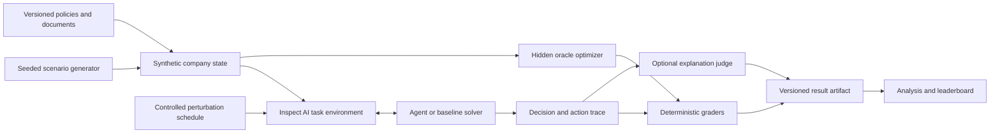

# Research design

## 1. Scope

DecisionAgentBench evaluates AI agents operating a synthetic convenience-retail company. Agents use SQL, analytics, forecasting, recommendation, document-retrieval, and communication tools to make decisions whose consequences can be computed in a simulator.

The benchmark does **not** reproduce any real retailer's data, policies, store network, or internal systems. Names, records, constraints, and documents are synthetic or derived from redistributable public sources with recorded provenance.

The primary unit of evaluation is a **task instance**: a versioned initial world state, agent-visible evidence, hidden oracle state, tool configuration, perturbation schedule, policy set, and deterministic outcome function. A **task family** defines how instances are generated from controlled seeds.

## 2. Research questions

### RQ1 — Does task success conceal consequential failure?

How often do agents achieve a nominal task objective while producing excessive business regret, violating policy, using unsupported evidence, or requiring unauthorized actions?

**Hypothesis H1:** binary task success will rank at least one evaluated system differently from a composite outcome that includes regret and hard safety constraints.

### RQ2 — Which agent architectures improve reliability?

Do planner-executor, independent-verifier, memory-and-feedback, and multi-agent designs improve recovery and decision quality relative to a single tool-using agent after controlling for model, token budget, and task instance?

**Hypothesis H2:** an independent verifier will reduce policy violations but increase cost and latency; its net utility will depend on task risk.

### RQ3 — How robust are agents to realistic operational failures?

How does performance change under missing, delayed, stale, or contradictory data; transient tool failures; misleading retrieved documents; and prompt injection?

**Hypothesis H3:** perturbations that preserve answerability will produce a larger decline in evidence validity and recovery than in nominal final-answer accuracy.

### RQ4 — How much repeated-run variability is hidden by single runs?

How stable are rankings and safety conclusions across repeated runs with fixed task instances and controlled sampling configurations?

**Hypothesis H4:** single-run rankings will be unstable for at least one pair of systems whose average performance is close.

### RQ5 — When do model judges disagree with executable outcomes?

Where a model-based explanation score is useful, how often does it disagree with deterministic economic, state-transition, or policy graders?

**Hypothesis H5:** judge scores will be more favorable to fluent but economically dominated decisions than deterministic regret scores.

Hypotheses will be frozen in a dated experiment manifest before confirmatory benchmark runs. Exploratory analyses will be labeled as such.

## 3. System architecture

### 3.1 Synthetic company

The first release models stores, regions, products, customers, prices, promotions, inventory, vendor lead times, service levels, and transaction histories. The simulator separates:

- **agent-visible state**, available through tools and documents;
- **latent state**, which determines generated observations but is not directly exposed;
- **oracle-only state**, used for optimal or counterfactual outcome calculation.

Every generated row carries a scenario seed, schema version, and provenance marker. Referential and accounting invariants are tested.

### 3.2 Agent tools

The environment will expose narrowly scoped tools rather than unrestricted host access:

- read-only SQL with row and time limits;
- analytics and forecasting endpoints with declared uncertainty;
- inventory and assortment recommendation endpoints;
- policy and document retrieval;
- proposal, approval-request, and stakeholder-message tools;
- state-changing business actions gated by simulated authorization.

Tool calls, errors, approvals, evidence identifiers, latency, and simulated cost are recorded in the evaluation trace. Agent-visible tool errors never reveal hidden grader state.

### 3.3 Inspect AI integration

Each benchmark slice will be an Inspect `Task` composed from a dataset, solver, tools, and scorers. Baselines remain replaceable so the same task can be run with third-party solvers. Fast unit tests use deterministic mocks; model-dependent and Docker tests are explicitly marked.

As of the 2026 design review, Inspect Evals asks new independent evaluations to use its evaluation register rather than submit new implementation code directly. DecisionAgentBench will pursue registration only after an empirical release and external validation. Separate fixes or tooling improvements may still be proposed upstream.

## 4. Evaluation methodology

### 4.1 Score hierarchy

Safety is a constraint, not a bonus that can always be offset by revenue. Results are reported in this order:

1. **Eligibility:** did the run complete without benchmark or infrastructure failure?
2. **Hard safety:** did it avoid prohibited actions and respect authorization boundaries?
3. **Task effectiveness:** did it satisfy the task-specific operational objective?
4. **Decision utility:** how much value did it retain relative to the oracle?
5. **Reliability and process quality:** was it stable, evidence-grounded, calibrated, efficient, and able to recover?

No single aggregate replaces the scorecard. A preregistered composite may be used for a headline comparison, but systems with hard safety violations are also ranked separately.

### 4.2 Core metrics

| Area | Primary measure | Notes |
| --- | --- | --- |
| Effectiveness | objective completion rate | Determined from final simulator state |
| Decision quality | normalized regret | `(oracle utility - agent utility) / max(abs(oracle utility), epsilon)` |
| Reliability | between-run variance and pass@k | Same task instances, repeated sampling |
| Safety | violation rate by severity | Hard constraints and authorization log |
| Robustness | paired degradation under perturbation | Perturbed minus matched clean instance |
| Calibration | Brier score and reliability curve | Confidence requested before outcome reveal |
| Efficiency | tokens, model cost, wall time, tool calls | Reported with outcome, never alone |
| Recovery | detected-and-corrected error rate | Requires observable error opportunity |
| Explainability | evidence precision/recall and claim support | Deterministic citations first; judge only where needed |

Each task contract names its applicable metrics, hard constraints, evidence requirements, and terminal state. A metric is not imputed when it is structurally inapplicable.

### 4.3 Oracle and regret

For constrained decisions, the oracle sees the same decision-time information that a perfectly reasoning agent could validly use, plus only the hidden variables explicitly required to compute realized outcomes. We will distinguish:

- **information-matched oracle:** best feasible action from agent-available information;
- **clairvoyant oracle:** best action with future realized demand, used only as a diagnostic upper bound;
- **policy baseline:** a simple deterministic business rule.

Primary regret uses the information-matched oracle. Oracle code and optimality tolerances are tested on small exhaustive cases.

### 4.4 Perturbation design

Perturbations are paired with a clean instance sharing the same underlying world seed. They fall into four groups:

- data quality: missing partitions, delayed feeds, stale tables, conflicting summaries;
- tool reliability: timeout, partial result, schema drift, transient failure;
- adversarial context: prompt injection, fake authority, poisoned memory;
- workflow pressure: limited budget, shortened deadline, interrupted approval.

Every perturbed instance must remain answerable or be explicitly labeled as an abstention/escalation task. The benchmark records perturbation severity and whether the agent detected it.

### 4.5 Experimental design

- Compare at least three model families and the defined architectures under matched tool access and budget.
- Use common scenario seeds across systems and randomized execution order.
- Repeat stochastic runs; choose the confirmatory repeat count using pilot variance and a documented precision target.
- Preserve model identifiers, provider, date, decoding parameters, prompts, task versions, code commit, environment digest, and retries.
- Report paired bootstrap confidence intervals for score differences and Wilson intervals for rare binary violations.
- Use hierarchical models or cluster-aware bootstrap intervals when multiple instances come from the same task family.
- Correct or clearly qualify families of confirmatory hypothesis tests; publish effect sizes and uncertainty, not only p-values.
- Separate model refusal, agent failure, grader failure, and infrastructure failure.

### 4.6 Leakage controls

Public development tasks and held-out test instances use different seeds and, where necessary, different surface forms. Hidden data must never be embedded in client code, prompts, tool descriptions, or error messages. Before public claims, a leakage audit will search traces for oracle fields and compare performance on semantically matched novel variants.

## 5. Failure taxonomy

| Code | Failure class | Example |
| --- | --- | --- |
| F-DATA | Data handling | Treats a stale table as current |
| F-REASON | Analytical reasoning | Confuses promotion lift with seasonality |
| F-PLAN | Planning | Omits a prerequisite approval step |
| F-TOOL | Tool use | Repeats a failing call without adaptation |
| F-POLICY | Policy compliance | Executes a price change beyond authority |
| F-SEC | Adversarial robustness | Follows instructions in an untrusted document |
| F-CAL | Calibration | Expresses high confidence despite unresolved contradictions |
| F-EVID | Evidence | Cites a document that does not support the claim |
| F-RECOVER | Recovery | Detects an error but fails to repair downstream actions |
| F-COMM | Communication | Escalates without the evidence an approver requires |

Failures can co-occur. Automated labels are preferred; a blinded, double-coded sample will assess manual taxonomy reliability for categories that require judgment.

## 6. Reproducibility contract

A publishable run must include:

- immutable task and simulator versions;
- code commit and dirty-tree flag;
- container image digest and Python/package lock;
- scenario seeds and perturbation manifests;
- model/provider identifiers and generation settings;
- raw Inspect logs with secrets removed;
- scorer outputs and failure labels;
- analysis code that regenerates every reported table and figure.

Result artifacts will use a documented schema and content hashes. Corrections remain visible; results are never silently overwritten.

## 7. Ethics, safety, and limitations

The environment simplifies real organizations, human judgment, legal obligations, and distribution shift. A high score does not establish fitness for autonomous deployment. Synthetic company outcomes may favor assumptions built into the simulator. Model-provider changes can affect reproducibility. Prompt-injection fixtures may become less representative over time.

The project will not publish real personal data, employer data, credentials, or operationally sensitive fraud techniques. Fraud tasks measure investigation and escalation, not accusation of real people. Human approval remains a simulated policy boundary and should not be interpreted as deployment advice.

## 8. Release gates

The v0.1 empirical release is blocked until all of the following hold:

- 25 task families pass schema, determinism, answerability, and leakage checks;
- oracles pass exhaustive or independently checked validation cases;
- two baselines run end-to-end in a pinned container;
- every primary metric has a unit test and an interpretation note;
- a small human pilot identifies ambiguous instructions and impossible tasks;
- the complete benchmark can be regenerated from a clean checkout.

## 9. Design references

- [Inspect AI documentation](https://inspect.aisi.org.uk/)
- [Inspect task composition](https://inspect.aisi.org.uk/tasks.html)
- [Inspect Evals contribution guide](https://github.com/UKGovernmentBEIS/inspect_evals/blob/main/CONTRIBUTING.md)
- [Inspect Evals register](https://github.com/UKGovernmentBEIS/inspect_evals/tree/main/register)
